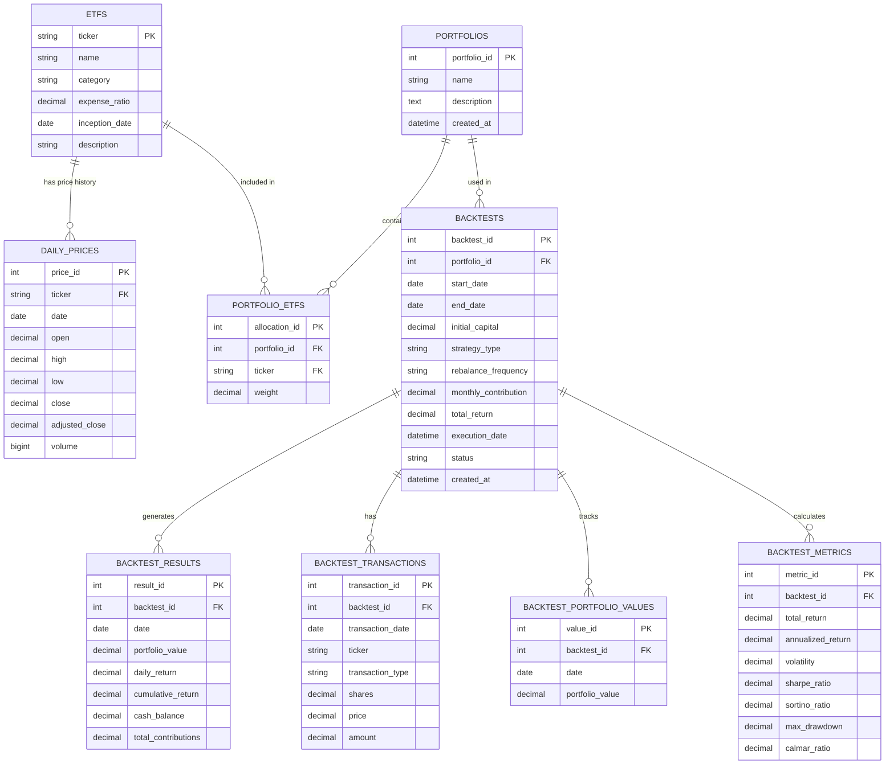

# ER Diagram - ETF Portfolio Backtesting System

## Entity-Relationship Diagram



## Tables Description

### 1. ETFS
- **Primary Key:** ticker
- **Description:** Stores ETF master data
- **Relationships:**
  - One ETF has many DAILY_PRICES
  - One ETF can be in many PORTFOLIO_ETFS

### 2. DAILY_PRICES
- **Primary Key:** price_id
- **Foreign Keys:** ticker → ETFS(ticker)
- **Description:** Historical daily price data for each ETF
- **Index:** (ticker, date) for fast lookups

### 3. PORTFOLIOS
- **Primary Key:** portfolio_id
- **Description:** Portfolio definitions
- **Relationships:**
  - One PORTFOLIO has many PORTFOLIO_ETFS
  - One PORTFOLIO can have many BACKTESTS

### 4. PORTFOLIO_ETFS
- **Primary Key:** allocation_id
- **Foreign Keys:**
  - portfolio_id → PORTFOLIOS(portfolio_id)
  - ticker → ETFS(ticker)
- **Description:** Portfolio composition (ETF allocations and weights)
- **Constraint:** SUM(weight) for each portfolio_id should equal 100

### 5. BACKTESTS
- **Primary Key:** backtest_id
- **Foreign Keys:** portfolio_id → PORTFOLIOS(portfolio_id)
- **Description:** Backtest execution records
- **Strategy Types:** 'Buy-and-Hold', 'Rebalanced', 'Dollar-Cost-Averaging'
- **Relationships:**
  - One BACKTEST has many BACKTEST_RESULTS
  - One BACKTEST has many BACKTEST_TRANSACTIONS
  - One BACKTEST has many BACKTEST_PORTFOLIO_VALUES
  - One BACKTEST has one BACKTEST_METRICS

### 6. BACKTEST_RESULTS
- **Primary Key:** result_id
- **Foreign Keys:** backtest_id → BACKTESTS(backtest_id)
- **Description:** Daily backtest results (portfolio value, returns)
- **Cardinality:** ~3,000-5,000 rows per backtest (10-20 years of daily data)

### 7. BACKTEST_TRANSACTIONS
- **Primary Key:** transaction_id
- **Foreign Keys:** backtest_id → BACKTESTS(backtest_id)
- **Description:** All buy/sell transactions during backtest
- **Transaction Types:** 'buy', 'sell'

### 8. BACKTEST_PORTFOLIO_VALUES
- **Primary Key:** value_id
- **Foreign Keys:** backtest_id → BACKTESTS(backtest_id)
- **Description:** Portfolio value snapshots

### 9. BACKTEST_METRICS
- **Primary Key:** metric_id
- **Foreign Keys:** backtest_id → BACKTESTS(backtest_id)
- **Description:** Calculated performance metrics for each backtest

## Key Relationships

1. **ETF → Prices (1:N)**
   - One ETF has many daily price records

2. **Portfolio → ETFs (M:N through PORTFOLIO_ETFS)**
   - Many portfolios can contain many ETFs
   - Junction table stores allocation weights

3. **Portfolio → Backtests (1:N)**
   - One portfolio can be backtested multiple times with different parameters

4. **Backtest → Results (1:N)**
   - One backtest generates many daily result records

## Normalization

The database follows **Third Normal Form (3NF)**:
- All tables have primary keys
- No repeating groups
- All non-key attributes depend on the primary key
- No transitive dependencies

## Indexes

For performance optimization:
```sql
-- Fast price lookups
INDEX idx_prices_ticker_date ON daily_prices(ticker, date)

-- Fast backtest lookups
INDEX idx_results_backtest ON backtest_results(backtest_id)
INDEX idx_transactions_backtest ON backtest_transactions(backtest_id)

-- Portfolio queries
INDEX idx_portfolio_etfs_portfolio ON portfolio_etfs(portfolio_id)
```

## Data Volume Estimates

| Table | Estimated Rows | Notes |
|-------|---------------|-------|
| ETFS | 40-50 | Major US ETFs |
| DAILY_PRICES | 150,000+ | 40 ETFs × 15 years × 250 days |
| PORTFOLIOS | 30-50 | Various portfolio strategies |
| PORTFOLIO_ETFS | 150-200 | Avg 4 ETFs per portfolio |
| BACKTESTS | 100-200 | Multiple backtest runs |
| BACKTEST_RESULTS | 500,000+ | 100 backtests × 5,000 days |
| BACKTEST_TRANSACTIONS | 10,000+ | Rebalancing transactions |
| BACKTEST_PORTFOLIO_VALUES | 500,000+ | Daily tracking |
| BACKTEST_METRICS | 100-200 | One per backtest |

---

**Generated for:** DADS4002 Programming Project
**Database:** MySQL 8.0+
**Date:** 2025
