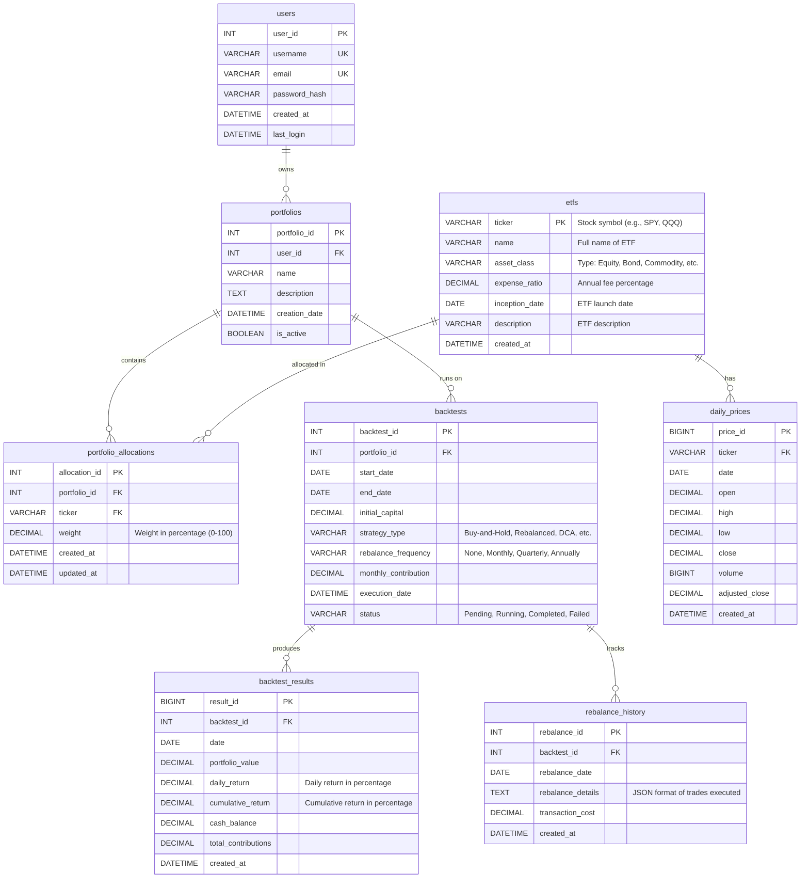

# ETF Portfolio Backtesting System - ER Diagram

## Entity Relationship Diagram



## Tables Summary

### 1. users
- **Purpose**: Store user information who create and manage portfolios
- **Primary Key**: `user_id`
- **Unique Keys**: `username`, `email`
- **Relationships**:
  - One user can have many portfolios (1:N)

### 2. etfs
- **Purpose**: Master table for ETF information
- **Primary Key**: `ticker`
- **Relationships**:
  - One ETF can have many daily price records (1:N)
  - One ETF can be in many portfolio allocations (1:N)

### 3. daily_prices
- **Purpose**: Store historical daily price data for each ETF
- **Primary Key**: `price_id`
- **Foreign Keys**: `ticker` → etfs(ticker)
- **Unique Constraint**: (ticker, date) - one price record per ETF per day
- **Indexes**:
  - ticker (for filtering by ETF)
  - date (for date range queries)
  - ticker + date (composite for unique constraint)

### 4. portfolios
- **Purpose**: Store portfolio configurations created by users
- **Primary Key**: `portfolio_id`
- **Foreign Keys**: `user_id` → users(user_id)
- **Relationships**:
  - One portfolio has many allocations (1:N)
  - One portfolio can have many backtests (1:N)

### 5. portfolio_allocations
- **Purpose**: Define the weight/percentage of each ETF in a portfolio
- **Primary Key**: `allocation_id`
- **Foreign Keys**:
  - `portfolio_id` → portfolios(portfolio_id)
  - `ticker` → etfs(ticker)
- **Business Rule**: Sum of weights for each portfolio should equal 100%

### 6. backtests
- **Purpose**: Store backtest configuration and metadata
- **Primary Key**: `backtest_id`
- **Foreign Keys**: `portfolio_id` → portfolios(portfolio_id)
- **Relationships**:
  - One backtest produces many result records (1:N)
  - One backtest can have many rebalance events (1:N)

### 7. backtest_results
- **Purpose**: Store daily results from running a backtest
- **Primary Key**: `result_id`
- **Foreign Keys**: `backtest_id` → backtests(backtest_id)
- **Note**: Can contain thousands of records per backtest (one per trading day)

### 8. rebalance_history
- **Purpose**: Track when and how portfolio was rebalanced during backtest
- **Primary Key**: `rebalance_id`
- **Foreign Keys**: `backtest_id` → backtests(backtest_id)
- **Note**: Stores trade details in JSON format for flexibility

## Key Design Decisions

### 1. Normalization
- Database follows 3NF (Third Normal Form)
- ETF information separated from daily prices to avoid redundancy
- Portfolio structure separated from backtest execution

### 2. Data Types
- **DECIMAL**: Used for financial data (prices, returns, percentages) to avoid floating-point precision issues
- **DATE**: For dates without time component
- **DATETIME**: For timestamps with time component
- **TEXT/JSON**: For flexible storage of complex data (descriptions, trade details)

### 3. Indexes (to be created)
- Primary keys automatically indexed
- Foreign keys should be indexed for join performance
- Composite index on (ticker, date) for daily_prices
- Index on backtest_id for backtest_results (large table)

### 4. Constraints
- Unique constraint on (ticker, date) in daily_prices
- Unique constraint on (portfolio_id, ticker) in portfolio_allocations
- Check constraint: weight >= 0 AND weight <= 100
- Check constraint: initial_capital > 0
- Check constraint: end_date >= start_date

### 5. Cascading Rules
- ON DELETE CASCADE for portfolio_allocations when portfolio is deleted
- ON DELETE CASCADE for backtest_results when backtest is deleted
- ON DELETE RESTRICT for etfs (cannot delete if used in allocations or prices)

## Sample Queries

### Portfolio Performance
```sql
SELECT
    p.name,
    b.strategy_type,
    MIN(br.portfolio_value) as min_value,
    MAX(br.portfolio_value) as max_value,
    (MAX(br.cumulative_return) * 100) as total_return_pct
FROM portfolios p
JOIN backtests b ON p.portfolio_id = b.portfolio_id
JOIN backtest_results br ON b.backtest_id = br.backtest_id
WHERE b.status = 'Completed'
GROUP BY p.portfolio_id, b.backtest_id;
```

### Portfolio Allocation
```sql
SELECT
    p.name as portfolio_name,
    e.ticker,
    e.name as etf_name,
    pa.weight,
    e.expense_ratio
FROM portfolios p
JOIN portfolio_allocations pa ON p.portfolio_id = pa.portfolio_id
JOIN etfs e ON pa.ticker = e.ticker
WHERE p.portfolio_id = 1
ORDER BY pa.weight DESC;
```

### Daily Returns Analysis
```sql
SELECT
    date,
    portfolio_value,
    daily_return,
    cumulative_return,
    LAG(portfolio_value) OVER (ORDER BY date) as prev_value
FROM backtest_results
WHERE backtest_id = 1
ORDER BY date;
```
