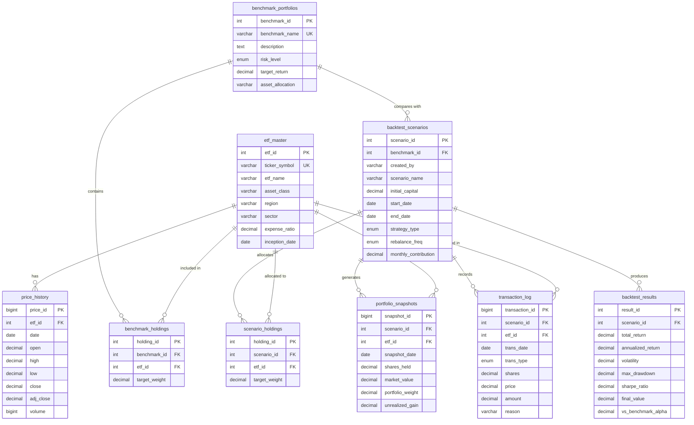

# Portfolio Backtesting System - ER Diagram

Entity-Relationship Diagram for the database schema

---

## 📊 ER Diagram (Mermaid Format)



---

## 🗂️ Database Structure Overview

### Core Data Tables (Read-Only)
These tables store master data and historical prices:

1. **etf_master** (50 rows)
   - Primary Key: `etf_id`
   - Stores ETF metadata
   - Referenced by all other tables

2. **price_history** (208,700+ rows)
   - Primary Key: `price_id`
   - Foreign Key: `etf_id` → `etf_master`
   - Stores daily OHLCV data

### Benchmark Tables (Read-Only)
These tables store famous portfolio strategies:

3. **benchmark_portfolios** (35 rows)
   - Primary Key: `benchmark_id`
   - Stores portfolio strategies

4. **benchmark_holdings** (117 rows)
   - Primary Key: `holding_id`
   - Foreign Keys: `benchmark_id`, `etf_id`
   - Stores ETF allocations for each benchmark

### User Scenario Tables (Read-Write)
These tables store user-created backtests:

5. **backtest_scenarios** (User-created)
   - Primary Key: `scenario_id`
   - Foreign Key: `benchmark_id` (optional)
   - Stores backtest configurations

6. **scenario_holdings** (User-created)
   - Primary Key: `holding_id`
   - Foreign Keys: `scenario_id`, `etf_id`
   - Stores ETF allocations for user scenarios

### Results Tables (Calculated)
These tables store computed results:

7. **backtest_results** (Calculated)
   - Primary Key: `result_id`
   - Foreign Key: `scenario_id`
   - Stores performance metrics

8. **portfolio_snapshots** (Generated)
   - Primary Key: `snapshot_id`
   - Foreign Keys: `scenario_id`, `etf_id`
   - Stores portfolio values over time

9. **transaction_log** (Generated)
   - Primary Key: `transaction_id`
   - Foreign Keys: `scenario_id`, `etf_id`
   - Stores buy/sell/rebalance transactions

---

## 🔗 Relationships Summary

### One-to-Many Relationships

| Parent Table | Child Table | Relationship |
|--------------|-------------|--------------|
| `etf_master` | `price_history` | 1:N (One ETF has many price records) |
| `etf_master` | `benchmark_holdings` | 1:N (One ETF in many benchmarks) |
| `etf_master` | `scenario_holdings` | 1:N (One ETF in many scenarios) |
| `etf_master` | `portfolio_snapshots` | 1:N (One ETF tracked many times) |
| `etf_master` | `transaction_log` | 1:N (One ETF traded many times) |
| `benchmark_portfolios` | `benchmark_holdings` | 1:N (One benchmark has many ETFs) |
| `benchmark_portfolios` | `backtest_scenarios` | 1:N (One benchmark compared by many scenarios) |
| `backtest_scenarios` | `scenario_holdings` | 1:N (One scenario has many ETFs) |
| `backtest_scenarios` | `backtest_results` | 1:1 (One scenario has one result) |
| `backtest_scenarios` | `portfolio_snapshots` | 1:N (One scenario has many snapshots) |
| `backtest_scenarios` | `transaction_log` | 1:N (One scenario has many transactions) |

### Key Constraints

- **Unique Constraints:**
  - `etf_master.ticker_symbol` (e.g., SPY, VOO)
  - `benchmark_portfolios.benchmark_name` (e.g., "60/40")
  - `price_history(etf_id, date)` (One price per ETF per day)
  - `benchmark_holdings(benchmark_id, etf_id)` (No duplicate ETFs in benchmark)
  - `scenario_holdings(scenario_id, etf_id)` (No duplicate ETFs in scenario)

- **Cascade Delete:**
  - Delete ETF → Delete all related prices, holdings, snapshots
  - Delete Benchmark → Delete all holdings
  - Delete Scenario → Delete all holdings, results, snapshots, transactions

---

## 📐 Data Flow

### Workflow 1: User Creates Backtest Scenario

```
User Input
    ↓
backtest_scenarios (Create scenario)
    ↓
scenario_holdings (Add ETF allocations)
    ↓
Backtest Engine (Python + SQL)
    ↓
├── backtest_results (Store metrics)
├── portfolio_snapshots (Store daily values)
└── transaction_log (Store transactions)
```

### Workflow 2: Compare with Benchmark

```
backtest_scenarios.benchmark_id
    ↓
benchmark_portfolios (Get benchmark info)
    ↓
benchmark_holdings (Get benchmark allocations)
    ↓
SQL Query (Calculate benchmark performance)
    ↓
backtest_results.vs_benchmark_alpha (Store alpha)
```

---

## 🎯 Key Features

### 1. Referential Integrity
- All foreign keys properly defined
- Cascade deletes prevent orphaned records
- Unique constraints prevent duplicates

### 2. Indexed for Performance
- Primary keys on all tables
- Foreign keys indexed
- Date columns indexed for time-series queries
- Ticker symbol indexed for lookups

### 3. Flexible Design
- Optional benchmark comparison
- Multiple strategy types (Buy&Hold, DCA, Rebalance)
- Extensible for new features

### 4. Data Separation
- Core data (ETF, prices) separate from user data
- Benchmark data separate from scenarios
- Results separated from inputs

---

## 📏 Table Sizes (After Import)

| Table | Rows | Growth |
|-------|------|--------|
| etf_master | 50 | Static |
| price_history | 208,700+ | Daily updates |
| benchmark_portfolios | 35 | Static |
| benchmark_holdings | 117 | Static |
| backtest_scenarios | 0 → ∞ | User growth |
| scenario_holdings | 0 → ∞ | User growth |
| backtest_results | 0 → ∞ | Calculated |
| portfolio_snapshots | 0 → ∞ | Calculated |
| transaction_log | 0 → ∞ | Calculated |

**Total Initial Size:** ~209,000 rows
**After 100 scenarios:** ~300,000+ rows

---

## 🔍 Example Queries

### Get All ETFs with Latest Price
```sql
SELECT
    e.ticker_symbol,
    e.etf_name,
    p.date,
    p.close
FROM etf_master e
JOIN price_history p ON e.etf_id = p.etf_id
WHERE p.date = (SELECT MAX(date) FROM price_history WHERE etf_id = e.etf_id);
```

### Get Benchmark Portfolio Allocations
```sql
SELECT
    bp.benchmark_name,
    e.ticker_symbol,
    bh.target_weight
FROM benchmark_portfolios bp
JOIN benchmark_holdings bh ON bp.benchmark_id = bh.benchmark_id
JOIN etf_master e ON bh.etf_id = e.etf_id
WHERE bp.benchmark_name = 'Traditional 60/40'
ORDER BY bh.target_weight DESC;
```

### Get Scenario with Results
```sql
SELECT
    s.scenario_name,
    s.strategy_type,
    r.annualized_return,
    r.volatility,
    r.sharpe_ratio,
    r.vs_benchmark_alpha
FROM backtest_scenarios s
JOIN backtest_results r ON s.scenario_id = r.scenario_id
ORDER BY r.annualized_return DESC;
```

---

## 📝 Notes

- **PK** = Primary Key
- **FK** = Foreign Key
- **UK** = Unique Key
- All timestamps use `TIMESTAMP DEFAULT CURRENT_TIMESTAMP`
- All monetary values use `DECIMAL` for precision
- Enum types ensure data consistency

---

**Created:** 2024-11-18
**Database:** portfolio_backtesting
**Engine:** InnoDB
**Charset:** utf8mb4
